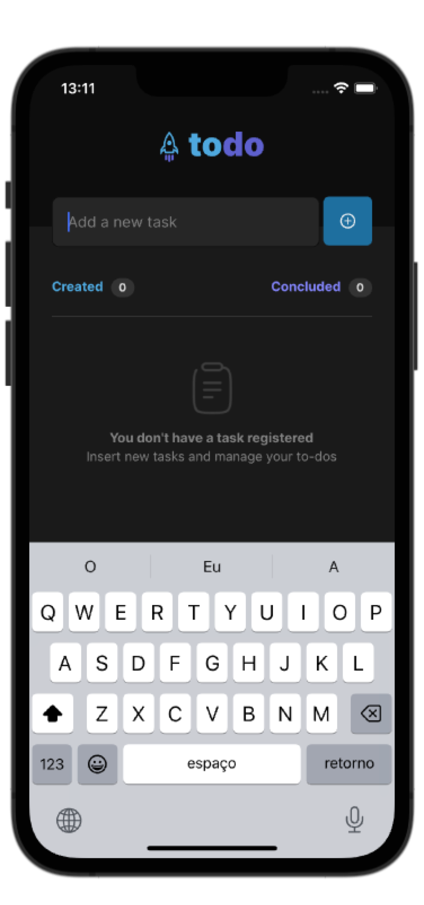
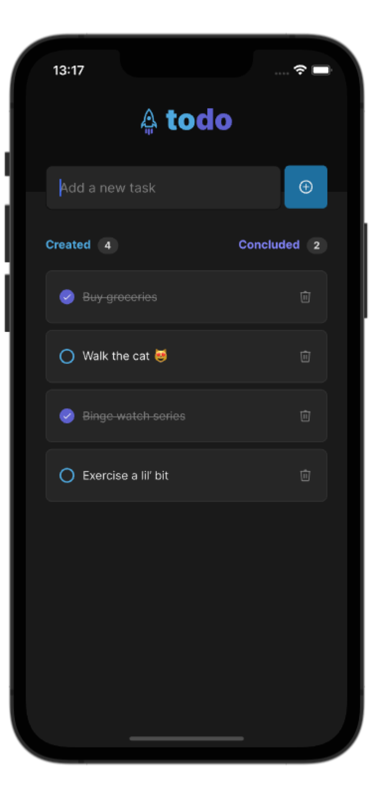

# 
# ToDo List - React Native App
<table>
<tr>
<td>
  Learning project of a React Native app to create and manage daily to-do tasks. Developed with Typescript and react-native-uuid.
</td>
</tr>
</table>

&nbsp;

# The App
Here are a couple screenshot of the app.

